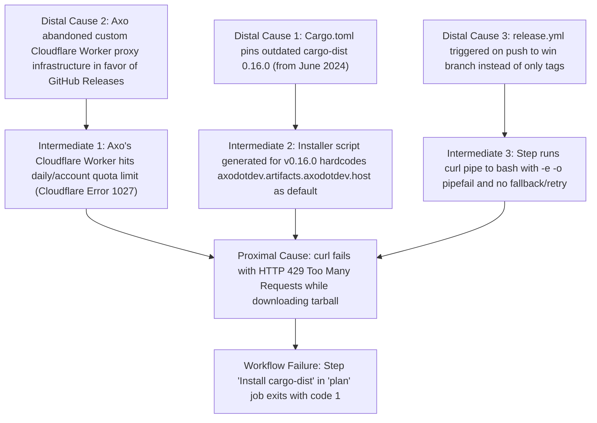

# Windows Support & CI/CD Findings

## 1. Overview
This document summarizes the technical findings, architectural observations, and configuration details discovered while porting **drivel** to Windows and configuring GitHub Actions CI and Release workflows on the `win` branch.

---

## 2. Key Findings

### 2.1 Jemallocator & Windows Portability
* **Incompatibility**: `jemallocator` (and `jemalloc-sys`) is not supported on MSVC Windows targets (`x86_64-pc-windows-msvc`).
* **Isolation**: In [`Cargo.toml`](../../Cargo.toml), moving `jemallocator = "0.5.4"` under `[target.'cfg(not(windows))'.dependencies]` and guarding the global allocator static in [`src/main.rs`](../../src/main.rs) with `#[cfg(not(windows))]` allowed Windows builds to fall back cleanly to the system allocator.
* **Test Suite Robustness**: Once `jemallocator` was conditionally excluded, **all 119 unit tests and 11 doc-tests passed on Windows on the first attempt**. No issues were encountered with:
  * File path separators (`\` vs `/`).
  * Carriage return / line feed normalization (`\r\n` vs `\n`).
  * JSON/YAML schema inference precision across platform architectures.

---

### 2.2 `cargo-dist` Workflow Mechanics & The "Branch Push Trap"
* **Binary Trigger Assumption**: The standard `cargo-dist` GitHub Actions template ([`.github/workflows/release.yml`](../../.github/workflows/release.yml)) is structured around an assumption that CI events are either:
  1. A `pull_request` (evaluated via `${{ github.event.pull_request }}`), or
  2. A SemVer release tag push (e.g., `v0.1.0`).
* **The Branch Trap**:
  * If a branch like `win` is added to `on.push.branches` without modifying the workflow steps, `${{ !github.event.pull_request }}` evaluates to `true`.
  * The `plan` step then invokes `cargo dist host --steps=create --tag=win`, treating the branch name as a release version.
  * Because `"win"` fails the SemVer regex check, the plan step fails immediately.
* **The Solution**:
  * Conditioned `tag`, `tag-flag`, and `publishing` outputs on whether the ref is actually a tag:
    ```yaml
    tag: ${{ startsWith(github.ref, 'refs/tags/') && github.ref_name || '' }}
    tag-flag: ${{ startsWith(github.ref, 'refs/tags/') && format('--tag={0}', github.ref_name) || '' }}
    publishing: ${{ startsWith(github.ref, 'refs/tags/') }}
    ```
  * In the `plan` step command:
    ```yaml
    cargo dist ${{ (startsWith(github.ref, 'refs/tags/') && format('host --steps=create --tag={0}', github.ref_name)) || 'plan' }} --output-format=json > plan-dist-manifest.json
    ```

---

### 2.3 Parameterized `cargo-dist` Target Configuration
* Instead of hardcoding or copy-pasting manual workflow steps into GitHub Actions, `cargo-dist` workflows are driven by workspace metadata parameters in [`Cargo.toml`](../../Cargo.toml):
  ```toml
  [workspace.metadata.dist]
  cargo-dist-version = "0.16.0"
  ci = "github"
  installers = ["powershell"]
  targets = ["x86_64-pc-windows-msvc"]
  pr-run-mode = "upload"
  install-updater = false
  ```
* **Orchestrator vs. Runner Model**:
  * `cargo-dist` uses Linux (`ubuntu-latest`) as an orchestrator for planning (`plan`), universal asset bundling (`build-global-artifacts`), hosting (`host`), and publishing (`announce`).
  * The actual build matrix (`build-local-artifacts`) is dynamically populated from the `plan` manifest, targeting `windows-2022` for `x86_64-pc-windows-msvc`.
* **`pr-run-mode = "upload"`**:
  * Under the default `pr-run-mode = "plan"`, `build-local-artifacts` is skipped unless `publishing == true`.
  * Setting `pr-run-mode = "upload"` ensures that branch test runs and pull requests compile the native Windows executable and upload the build artifacts to the run summary.

---

### 2.4 Runner Image Deprecation
* The original `release.yml` workflow pinned runners to `ubuntu-20.04`.
* `ubuntu-20.04` has been deprecated and retired on GitHub-hosted runners; jobs were updated to `ubuntu-latest` to avoid immediate runner provisioning failures.

---

## 3. Workflow Verification & Execution Results

Pushing commit `167955d` to `origin/win` triggered both workflows:
* **CI Workflow (Run `34539481795`)**:
  * **Result**: **Success (`✓`)** in 1m 9s.
  * `cargo build` and `cargo test` both passed cleanly on GitHub Actions.
* **Release Workflow (Run `34539481822`)**:
  * **Result**: **Failure** at `plan -> Install cargo-dist`.
  * **Root Cause**: The third-party host `https://axodotdev.artifacts.axodotdev.host` returned HTTP 429 (Too Many Requests rate limit) when downloading `cargo-dist-x86_64-unknown-linux-gnu.tar.xz`.
  * **Mitigation**: Upgrading `cargo-dist-version` in `Cargo.toml` or using `cargo-binstall` / GitHub releases fallback for the installer can improve resilience against CDN rate limits on axodotdev's artifact host.


---

## 4. Deep-Dive Root Cause Analysis: GitHub Actions Run 34539481822

### 4.1 Log Evidence & Failure Signature
From `gh run view --job=103078650765 --log`:
```text
plan	Install cargo-dist	curl --proto '=https' --tlsv1.2 -LsSf https://github.com/axodotdev/cargo-dist/releases/download/v0.16.0/cargo-dist-installer.sh | sh
plan	Install cargo-dist	shell: /usr/bin/bash --noprofile --norc -e -o pipefail {0}
plan	Install cargo-dist	downloading cargo-dist 0.16.0 x86_64-unknown-linux-gnu
plan	Install cargo-dist	curl: (22) The requested URL returned error: 429
plan	Install cargo-dist	failed to download https://axodotdev.artifacts.axodotdev.host/cargo-dist/ax_M5o2xMTpxp08gEzPalqmA/cargo-dist-x86_64-unknown-linux-gnu.tar.xz
plan	Install cargo-dist	##[error]Process completed with exit code 1.
```

### 4.2 Causal Chain Analysis (Proximal to Distal)



1. **Proximal Cause (Immediate Execution Error)**:
   * During the `plan` job in `.github/workflows/release.yml`, step `Install cargo-dist` executes `curl | sh`.
   * The `cargo-dist-installer.sh` script executes `curl` to fetch `https://axodotdev.artifacts.axodotdev.host/cargo-dist/ax_M5o2xMTpxp08gEzPalqmA/cargo-dist-x86_64-unknown-linux-gnu.tar.xz`.
   * The server returns `HTTP 429 Too Many Requests`.
   * `curl` returns exit code 22; because the shell runs under `set -e -o pipefail`, the step fails immediately.

2. **Intermediate Causes (Installer Behavior & Environment)**:
   * In `cargo-dist` v0.16.0, `cargo-dist-installer.sh` (and `cargo-dist-installer.ps1`) defaulted to `https://axodotdev.artifacts.axodotdev.host/cargo-dist/ax_M5o2xMTpxp08gEzPalqmA`.
   * The script lacked retry loops and fallback URLs.
   * `INSTALLER_DOWNLOAD_URL` was not passed as an environment variable in GitHub Actions, preventing redirection to reliable mirrors.
   * Furthermore, `cargo-dist-installer.ps1` for Windows runners also had this same default URL, meaning `build-local-artifacts` would have faced the identical 429 failure.

3. **Distal Causes (Architecture, Tooling Lifecycle & Upstream Infrastructure)**:
   * **Deprecation of Axo Hosting**: Axo previously ran an artifact proxy worker on Cloudflare. Due to costs and quota exhaustion (`Cloudflare Error 1027`), Axo deprecated this endpoint.
   * **Upstream Shift to GitHub Releases**: In modern versions (`0.30.0` - `0.32.0`), `cargo-dist` eliminated `artifacts.axodotdev.host` entirely. The installer scripts now point directly to `https://github.com/axodotdev/cargo-dist/releases/download/v...` by default, support multi-URL fallback arrays (`ARTIFACT_DOWNLOAD_URLS`), and include enhanced retry/GHE support.
   * **Configuration Pinning**: `Cargo.toml` pinned `cargo-dist-version = "0.16.0"`, leaving the CI configuration reliant on broken infrastructure.
   * **Workflow Triggering**: Pushing to `win` triggered `release.yml` because `branches: [ win ]` was added to `on: push:`, exposing the release pipeline to execution on branch pushes.

---

## 5. Remediation Plan

1. **Update `Cargo.toml`**:
   * Bump `cargo-dist-version` to `"0.32.0"`.
2. **Modernize `.github/workflows/release.yml`**:
   * Update the installer URLs to `v0.32.0`.
   * In modern `cargo-dist`, `cargo-dist-installer.sh` downloads directly from GitHub Releases (`github.com/axodotdev/cargo-dist/releases/download/v0.32.0/...`), completely avoiding third-party rate limits.
   * Ensure `INSTALLER_DOWNLOAD_URL` / `CARGO_DIST_DOWNLOAD_URL` is set or defaults to GitHub Releases.
3. **Workflow Trigger Scope**:
   * Keep `workflow_dispatch` and tags `**[0-9]+.[0-9]+.[0-9]+*`.
   * Maintain `branches: [ win ]` so that PRs and branch validation can build and upload native artifacts (`pr-run-mode = "upload"`).
